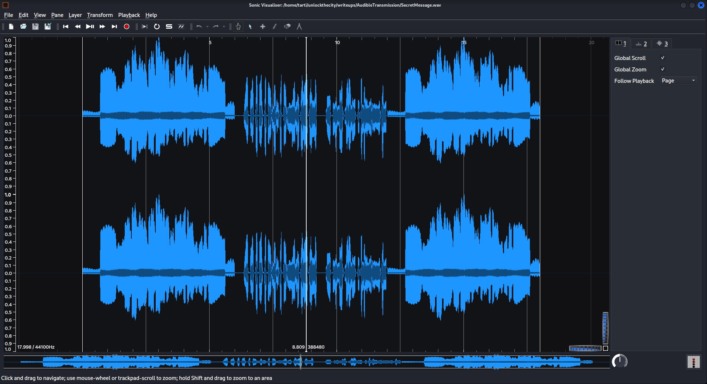
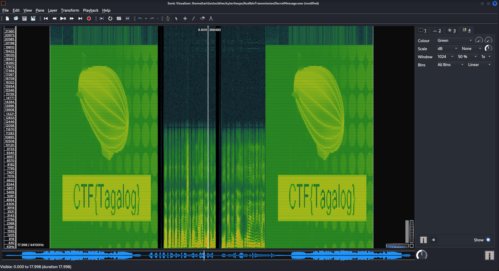
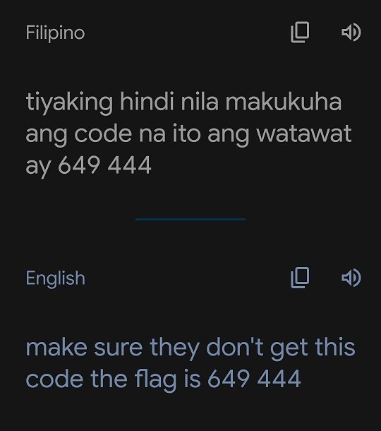

# Audible Transmission, 100 points

## Flag 1

We upload a wav file.
My first instinct is to analyze it with sonic visualization.

By doing SHIFT + G to add a spectrogram, we see this:

**Flag 1 : CTF{Tagalog}**

## Flag 2

After some research, Tagalog is the Filipino national language.

I also noticed that we hear a voice in the middle of the clip, but it's reversed.

I used the command:
`sox SecretMessage.wav SecretMessageReversed.wav reverse`

Then I played the recording to Google Translate

**Flag 2 : CTF{649444}**