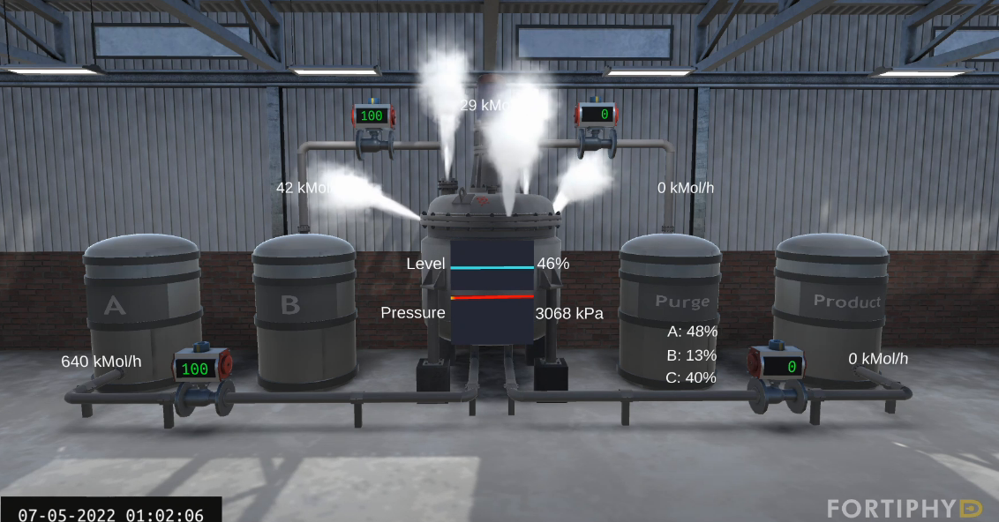
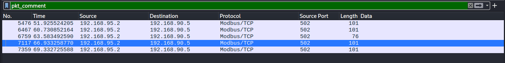
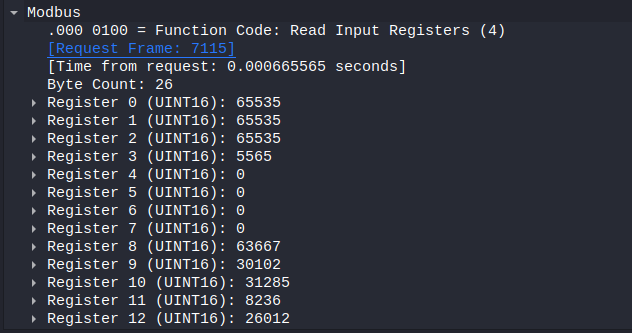

This challenge was label as esay    

We were given a [pcapng](./files/chemical_plant_explosion.pcapng) and a [mp4](./files/chemical_plant_explosion.mp4)

## **1st Flag (10 points)**

For the first part we were supposed to find which component was altered in the plant and put it in the flag template.

Thanks to the video we could see that the pressure was increasing till the plant explode.

> CTF{pressure}

  
## **2nd Flag (40 points)**

In the second part we had to pinpoint the exact moment of the attack in the network.  
We have to use the pcapng for this one however we had a hard time finding this flag cause we didn't know about packet comments.
In Wireshark, if you pass **pkt_comment** as a filter you will be left with these : 

And in one of the packets you can find the following :
*You found the point of explosion! Q1RGe00wREJVNV9SRTREX1IxR0hUfQ==*

> CTF{M0DBU5_RE4D_R1GHT}

  
## **3rd Flag (30 points)**

In this one we had to find the setpoint value of the attacked component.  
And the hint was : *HINT: A setpoint value does not change under any circumstance*

We did not really know what we were looking for but we found this in the modbus layer in the packets details : 

And we also found out that the first four values never change. We tried 65535 and it worked

> CTF{65535}

  
## **4th Flag (20 points)**

For the last part we had to find what type of data is stored in register coils. 

In one of the packets comments in the second part you can find : *Coils seem to hold binary values...*

However since we didn't know about comments we had to search through the modbus docs :/

> CTF{binary}