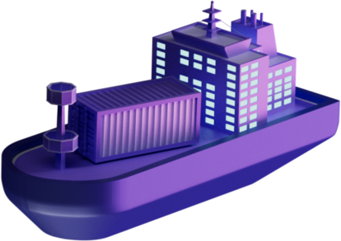
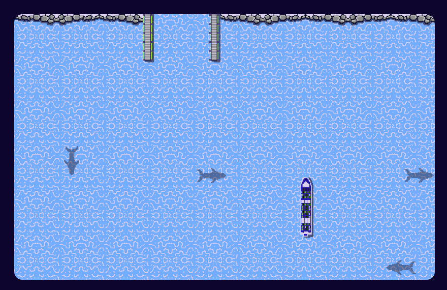

This challenge was label as hard    

|> [1st Flag](#1st-flag-25-points)  
|> [2nd Flag](#2nd-flag-25-points)  
|> [3rd Flag](#3rd-flag-50-points)  
|> [4th Flag](#4th-flag-50-points)  
|> [5th Flag](#5th-flag-200-points)    

Started the backend system and we had this interface and this manual :

 

 
As said in the manual we have to bring the ships safely back to the port using websockets.

Since I forgot to save the file of the first four flags, I'm just gonna explain how to connect and control the ships using websockets, explain the strategies I used and share with you my code for the last flag (don't expect something crazy, I solved it the worst way possible).

  
 

## **1st Flag (25 points)** 

 

First we have to connect and send : **{"type": "START_GAME", "level": 1}**.

It can be done using this script : 

 

Don't forget to put **wss** at the start your url and **/ws** at the end. Also notice that **it didn't worked for me in python 3.10** so i used 3.9  

After running this script the map change into this :

 

 

Basiclly, the ship is mooving straightforward, bouncing on the edges and explode when hitting the rocks.
We also receive a lot of informations about the direction, speed, position, id, name of the ship and the position of the rock border and the port.

In order to move to ship we can send : **{"type": "SHIP_STEER", "shipId": int}** with the id of the ship, however it only turn the ship to the left. So if you want the boat to turn to the right you have to send it 3 times.

To control the ship I made something like that : 

Just put the ship in the port, break the loop, print what's received and when the ship is in the harbour you should receive this : **{"type":"WIN","flag":"CTF{CapTA1n-cRUCh}"}** 

 

> CTF{CapTA1n-cRUCh}

  

## **2nd Flag (25 points)** 

In order to access the second lvl you have to send this to start the game : **{ "type": "START_GAME", "level": 2, "password": [PREVIOUS_LEVEL_FLAG_HERE] }**  

For this one the map looks like this:

  

We have 3 ships and we have to respect the order which is the smaller id first.

 

So, for the next flags i think we were supposed to code something that would check the ships and the obstacles positions and automaticly leads them to the port without any colisions. However i didn't want to do that since i thought it would be too long and complex, thus for the next flags i just blocked the ships somewhere in the map and control them by hand when it was their turn to go. (I know it's like the worst way to solve a programation challenge)

 

So for this one i bind a key to each ship and manage to put them horizontally so they would bounce on the edges, and lead the required one manually to the port.

 

> CTF{capt41n-h00k!}

   

## **3rd Flag (50 points)**

For this one the map looks like this:

  

We have 3 ships, the edges are still bouncing but now there is rocks in the sea

 

The strategy i used here was to make the boats spin on themselves indefinitely, by pressing a key i would take the control of the next ship and it would stop spining, then I would lead it manually to the port without knocking the rocks

 

> CTF{c4pt41N-m0rG4N}

  

## **4th Flag (50 points)** 

The map looks like this:

  

We have 4 ships, the edges don't bounce no more and there is rocks

 

The strategy i used here was the same as before : make the boats spin, lead them to the port by hand.

 

> CTF{C4pt41N-4MErIc4}

  

## **5th Flag (200 points)** 

The map looks like this:

  

We have 6 ships, edges don't bounce and there is a ton of rocks especially in front of the port.

 

For this one i couldn't use the spin strategy cause some ships are too close of the rocks. So i just tried to block them at the bottom of the map by getting their y positions and making them turn around when they were to close of the edges. 

Yet, I couldn't make it work in one script so i had to make two of them : [port.py](./files/port.py) and [move.py](./files/move.py).

 

Port.py is starting the game, placing the ships vertically and making sure they're not getting out of the defined zone.

Move.py is in charge of moving the ships.

 

Basiclly how this work is that you open two terminals to run both of the scripts, you can start with the one you want it doesn't change anything, just wait till the ships are bouncing a the bottom. To move a ship you just got to input anything to port.py and he will stop making the next ship bounce, then you can use these key in move.py to move it: 

* **a** : turn the ship to the left for every "a" you input.
* **e** : stop listening to your input and juste print everything it receive.
* **z** : will automatically put the ship in the port when positioned in the green square like the red arrow: 

  

 

> CTF{CaPT41n-j4Ck-sp4rR0w}

 

I know it's not really clear, sometime the ships are still hitting the edges, the scripts are pretty messy and it's 100% the worth way to flag the last one but anyways it works sometimes and i had fun doing it.
