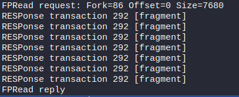
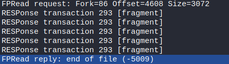
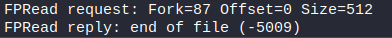
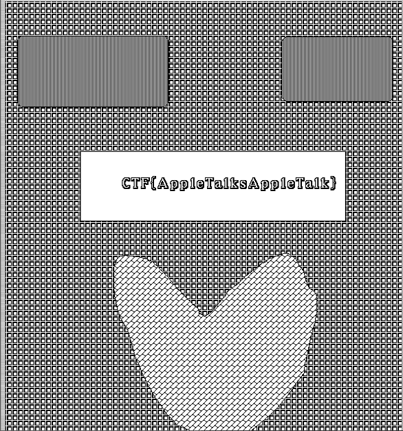

This challenge was label as hard and was worth 300 points    

We were given a simple pcapng file : [techinical-debt.pcapng](./files/technical-debt.pcapng).

After oppening it in Wireshark we see that there is a lot of encypted data send over SSL, and some request/response made with AFP.
Quick research tells us that AFP (Apple Filing Protocol) is file sharing protocol used on Macintosh.

By looking at the AFP packets we can find the name of a file : **image1** and some strange responses : 

All the RESponse transaction contain 582 bytes of data and are reassembled in the FPRead reply. 
In the first place 4608 bytes are transfer, than 2919 and finally 501.

At this point my strategy was to get all the hexadecimal datas transfered after the FPRead requests, turn them into bytes, and hope I could open the final output.

Using this [tiny python script](./files/hex2bytes.py) over this [file](./files/hexa) I was able to get the [following](./files/test.pntg).

However I wasn't able to open it and the file command was telling me that it only contains data. But after looking again in the pcapng file I discovered that the file was a MacPaint image data (PNTG) and that it could be open with Quicktime (https://discussions.apple.com/thread/6900064)

Changing OS ...

Downloading Quicktime for Windows ...

And Tadam:

> CTF{AppleTalksAppleTalk}

I really liked this challenge cause I first thought it would be to hard but finally he was really cool to solve and wasn't that difficult. 👍
