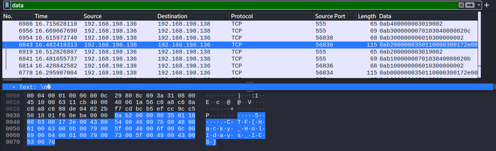
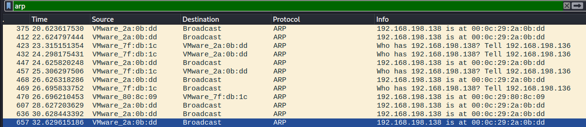
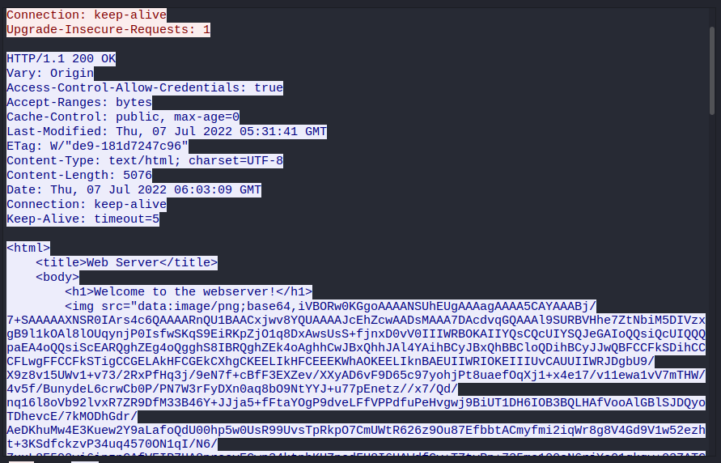
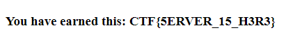

This challenge was label as esay    

We were given a two pcapng files : [modbus.pcapng](./files/modbus.pcapng) and [network.pcapng](./files/network.pcapng).

## **1st Flag (30 points)**

> "The file shows communication between a PLC and an ICS workstation. Analyze the file to get the flag! (use modbus.pcapng)" 

 

The first one was pretty easy. I opened the file in Wireshark, and without looking at what was happening I just tried basic investigation and filtered by data.  
Quick look in the packets and I found this :

> CTF{Hacky_Holidays_ICS}

  
## **2nd Flag (20 points)**

> "There seems to be some suspicious activity in the network. Can you identify the IP address of the rogue ICS component? (use network.pcapng)"

 

I found this one after the third and since the description deals with MITM and ARP, I filtered only the arp packets.
We can notice some interesting info : 

First we see that 00:0c:29:2a:0b:dd is sending a lot of ARP packets to the broadcast address saying he's 192.168.198.138. 

 

And that there is detection of a duplicate use of 192.168.198.138. This really looks like an ARP spoofing attack.  
Just finding what's the IP address of 00:0c:29:2a:0b:dd with this filter : **eth.src == 00:0c:29:2a:0b:dd** and we get the flag. (for this one we didn't have to use the flag template)

> 192.168.198.128

  
## **3rd Flag (20 points)**

> "What is the protocol used in the Man-in-the-Middle attack performed by the rogue ICS component in this network? (use network.pcapng), Flag format CTF
{protocol_in_capital_letters}"

 

Since MITM are usualy performed thanks to ARP, I tried ot and it worked !

> CTF{ARP}

  
## **4th Flag (30 points)**

> "The rogue component is communicating with an external entity, which is a big red flag in ICS environments. Can you find the flag from the network data?(use network.pcapng)
"

 

This one was a little harder but using this filter : **eth.src == 00:0c:29:2a:0b:dd && ip.dst != 192.168.198.0/16** which filter packages who were send by the mac address **00:0c:29:2a:0b:dd** and received by an ip outside the **192.168.198.0/24** network. We can find VNC connextions between .198.128 and .178.28. Following the stream, and we see the base64 of a picture :

I just put it in a online base64 to Image converter like [this one](https://codebeautify.org/base64-to-image-converter) and here it is :

> CTF{5ERVER_15_H3R3}
