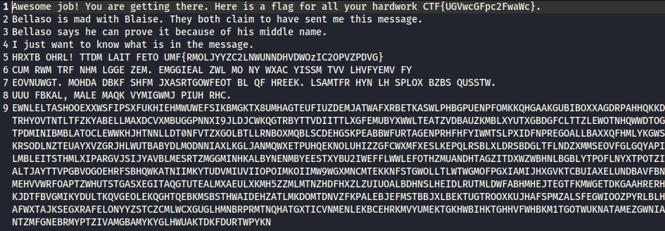
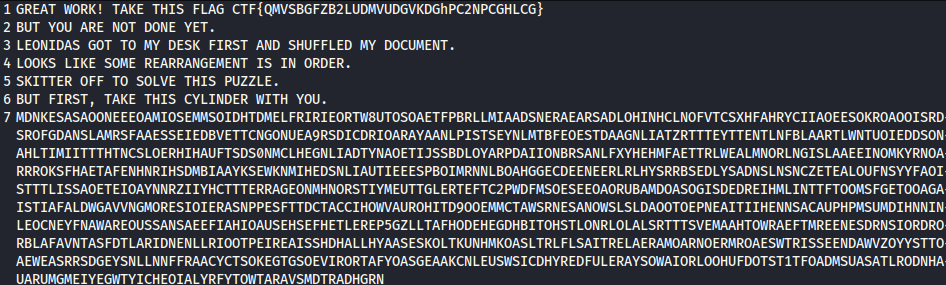
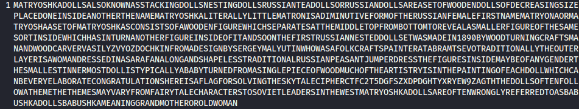
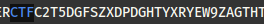

This challenge was label as easy    

## **1st Flag ㅤㅤ(50 points)**

We were given a single file : [binary.jpeg](./binary.jpeg)

By using `file binary.jpeg` we discover that the file isn't a jpeg but some ASCII text.
  After oppening it in a text editor we only find "(" and "9" by remplacing every "9" with 1 and "(" with 0 (either by hand in vscode or using a python script) and decoding the output we're able to get the following :

> CTF{UGVwcGFpc2FwaWc}

  
## **2nd Flagㅤㅤ (20 points)**

The previous output gives us the 1st flag but also some information for the 2nd.

The text makes reference to Bellaso and Blaise, after a quick research we find that the Vigenère cipher is named after Blaise de Vigenère, although Giovan Battista Bellaso had invented it.
Therefore our message must be encrypted with the Vigenère cipher, we can decrypt it [here](https://www.dcode.fr/chiffre-vigenere). The decryption key is the middle name of Bellaso as said in the output : Battista.

> CTF{QMVSBGFZB2LUDMVUDGVKDGhPC2NPCGHLCG}

  
## **3rd Flagㅤㅤ  (30 points)**

The title of this one was "Back to the basics", so we thought of the Scytale cypher : [here](https://www.dcode.fr/chiffre-scytale)  
We first decoded it with the "try every scale" option and we find some english words in the 10th, so we decoded the message with a size of 10 

By searching in the string we find :

Adding the "{}" and we have the flag.

> CTF{C2T5DGFSZXDPDGHTYXRYEW9ZAGTH}
