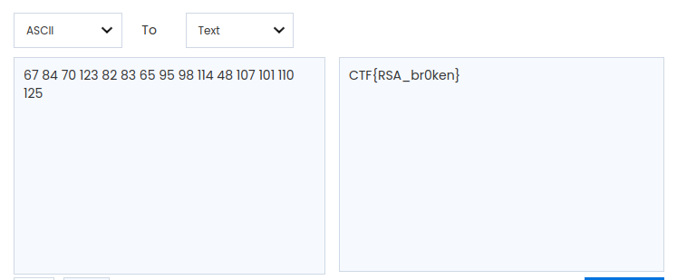

This challenge was label as easy and was worth 100 points   

We were given a single file : [message.txt](./message.txt)

The file contains a crypted message (C), an N value and an E value. It's obviously an RSA cypher, you can decode it [here](https://www.dcode.fr/chiffre-rsa).  
We first decoded it as clear text but we got this output : **���]�$EÖ��L3ݶ¥y¹?m**, and after a long time trying different ways to get the flag, turns out we have to decode it as an integer, which gave us : **67084070123082083065095098114048107101110125**.

The output integer is in fact multiple ascii numbers : (you can recognize the flag template thanks to 123 and 125 cause they stand for "{" and "}" )

**67 84 70 123 82 83 65 95 98 114 48 107 101 110 125**

and it gives us : 

> CTF{RSA_br0ken}

