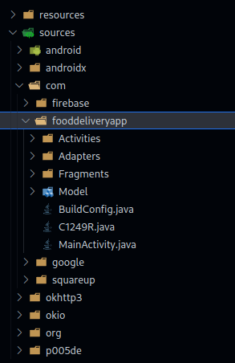

# Pizza Pazzi, 150 points

I started by decompiling the apk to be able to analyze it.
To do this, I used the site `http://www.javadecompilers.com/apk`

After downloading the zip that the site returned to me, I started digging through the files and came across:

"Food Delivery App", which made me think of... pizza!

After digging around a bit, you quickly find:

`https://pizzapazzi.challenge.hackazon.org/`

Which gives us the first flag:

**Flag 1: CTF{St4RT_Y0uR_3NG1N3X}**

We also find `Q1RGe1doMF80bV9JfQ==` and `Q1RGe1doNHRfMV80bV93MHJ0aH0=`

Which gives us :

**Flag 2: CTF{Wh0_4m_I}**
**Flag 3: CTF{Wh4t_1_4m_w0rth}**

And finally in another file (LoginActivity.java) we find `Q1RGe1doM3JlXzFzX3RoM19mMDBkfQ==`

So :

**Flag 4: CTF{Wh3re_1s_th3_f00d}**