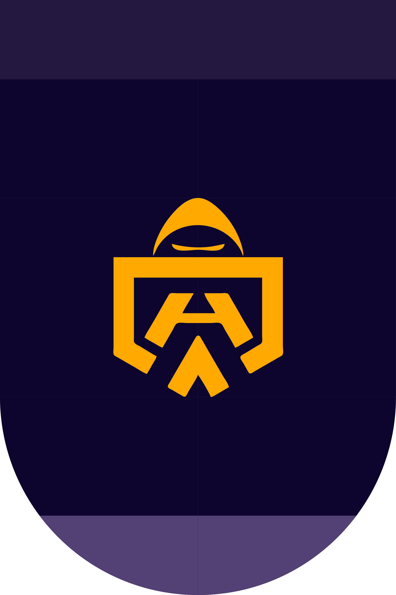
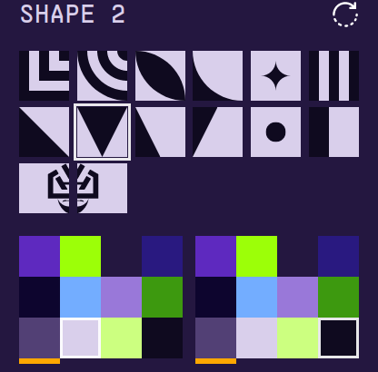
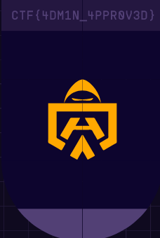

This challenge was label as beginner and was worth 50 points.   

We had acces to this [shield designer](https://portal.hackazon.org/#!/shielddesigner) and were supposed to reproduce this shield : 

   

 

***
 

The worst thing with this one is that we couldn't find the flag despite all our efforts, till we saw a write up of the Hacky holidays 2021 with the same Teaser. [here](https://youtu.be/hY446_xs-DE?t=56)

The only thing we had to do was to find the **hidden boutons** for the shapes and the color in the html. We felt really dumb ;-;

After making them **visible** just by changing their names you would have a lot more choice :

  

And after puting the right colors and shapes we had the following :

> CTF{4DM1N_4PPR0V3D}
